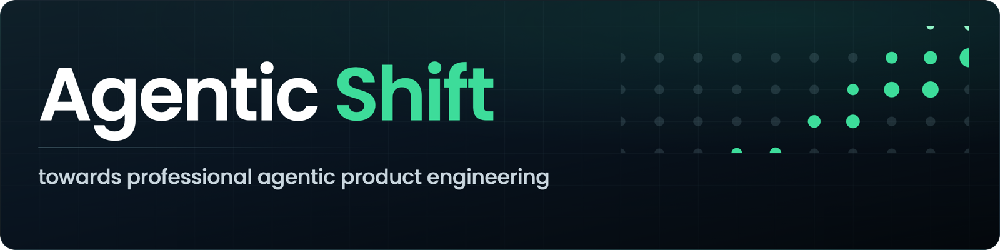

<p align="center">
  
</p>

# Agentic Shift

The industry-wide shift toward **agentic product engineering** is producing radically new
organizations. Most leaders haven't yet grasped how deep this goes. The ones who have are already
ahead of the curve. And the gap between the best and the rest widens every day.

To help these ideas spread, and to set a bar high enough to tell real change from
*mediocrity and marketing*, we're defining **professional agentic product engineering** as a set of
noticeable org-design shifts in how product engineering work gets done.

## Towards professional agentic product engineering, at org-level

### 1. features → systems
Product engineers stop shipping one-off features and shift to building agentic systems —
self-improving loops that turn intent into working solutions.

### 2. gatekeeping → guardrails
Product engineers stop inspecting for quality issues and shift to building quality into the system
through well-engineered agentic harnesses.

### 3. specialists → craftspeople
Product engineers shift from narrow, assembly-line specialists to end-to-end craftspeople — with AI
filling the specialist gaps in real time and mentoring the product engineers into new domains and
skills.

### 4. proxies → users
No more telephone game through manager-proxies, no more sitting in the basement — product engineers
shift to zero distance with the customers and users, to empathize, analyze, and synthesize firsthand.

### 5. output → outcomes
Product engineers shift from being measured by output to owning and driving outcomes themselves —
sensing drift and correcting course continuously.

## What's Next?

> **A new manifesto?**

It is perhaps *too early to write manifestos*, as the ground is still shifting — but we'd like to
acknowledge the strong changes we're already observing throughout the industry, most visible among
the frontrunners.

> **What does it mean for org leaders?**

While coding is now being automated and routinized, the craft of product engineering is undergoing
a major reinvention — one made possible only by distinctly human traits: **the drive for perfection**,
**unlimited creativity**, and **rich co-creation**. **The task of every organization and every leader
is to design environments that elevate human intelligence to these new heights.**

> **Want to contribute?**

Propose improvements. Share this page. Put these ideas to work in your organization.

Live at **[agentic-shift.com](https://agentic-shift.com)**.

---

## Tech Details

The website for agentic-shift.com — the manifesto above, and the Agentic Shift Munich meetups.

### Pages
- **`/`** — the manifesto (`public/index.html`).
- **`/munich`** — the Munich meetups: next event, Luma calendar, organizers, community, past
  events (`public/munich/index.html`).

### Stack
- Plain static site — HTML + CSS in `public/`, **no build step**.
- `server.js` (Node + Express) is a **local dev** server that adds clean routes (`/munich`, and a
  `/new` → `/` redirect). In production the `public/` folder is served statically (`vercel.json`).

### Run locally

```bash
npm install
node server.js        # → http://localhost:3000
```

(You can also just open `public/index.html` directly in a browser.)

### Deploy
Auto-deploys to [Vercel](https://vercel.com) on push to `main`.

### Design system
Both pages share `public/css/shift.css` — ink `#05090d`, teal `#3ddc9a`, amber `#e8a33d`, Poppins
headings + JetBrains Mono labels. `/munich` layers on `public/css/meetups.css`.

### Contributing
Open an issue or a pull request. This site is meant to spread: **share it, propose improvements, and
put the ideas to work in your own organization.**
