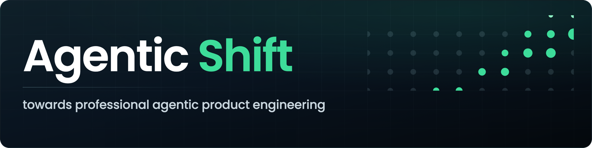

<p align="center">
  
</p>

# Agentic Shift

<!-- MANIFESTO:START -->

> _Generated from [`manifesto/content/en.json`](manifesto/content/en.json) — edit the JSON (and its siblings for other languages), then run `node manifesto/build.js`. Do not edit this section by hand._

_From tokenmaxing and other AI theater towards healthy organizations with great products and services._

## What we stand for

The **agentic shift** is real. It affects our organizations deeply, changing how we think about the work and the workers.

What we know, though, is that it is not about tooling, tokens, or any other output metric that happens to be easy to measure. It is about building better organizations that offer better products and services. That's what matters.

Everyone is optimizing for something. The frontier labs optimize for the adoption of their products, and FOMO is the strongest lever they pull on us. That is a legitimate business, and it is theirs, not ours.

Every organization is unique in the way it was built and in what it aspires to. We run **our** organizations, and we are judged on what matters to **us** — **our** customers, employees, and other stakeholders. So for us one thing is non-negotiable: **the agentic shift happens on our terms**.

## What we refuse to accept

By practicing critical thinking, we claim:

### lost judgment ≠ efficiency
We do not treat the loss of judgment of code, design, architecture, features, value as efficiency.

### vendor dependence ≠ progress
We do not accept dependence on AI vendors, their models and tooling, as progress.

### output volume ≠ capability
We do not confuse the ability to generate output with a strategic organizational capability.

In short, we do not let a shallow AI-adoption fad crowd out our long-term thinking about the organizations we are building. So we say: **“Org design, then AI.”** We learn to act strategically: we define what we want to shift in our organizations for the greater good, and then we apply AI — and other means — to make those shifts real.

## What we shift towards

Product engineering organizations that hold on to sustainable quality, customer value and high adaptability make the following strategic shifts, with AI as a lever to ease them:

### specialists → craftspeople
Enabling product engineers to shift from narrow, assembly-line specialists to end-to-end craftspeople — with AI filling the specialist gaps and offering upskilling for entering new domains.

### proxies → users
Ending the telephone game through manager-proxies and the era of “IT sitting in the basement” — instead putting product engineers at zero distance with the customers and users, to empathize, analyze, and synthesize firsthand.

### output → outcomes
Elevating product engineers from being measured by output to owning the complete value loop — ensuring real customer impact, experimenting and course-correcting as the evidence comes in.

Which shifts your organization takes on is **yours to decide**. What matters is that they are **strategic, not shortsighted** — that they serve the organization you want to have in years rather than the numbers FOMO would have you chase this quarter.

## What's Next?

> **Want to contribute?**

[Propose improvements](https://github.com/krivitsky/agentic-shift). Share this page. Put these ideas to work in your organization.

> **Want to go deeper?**

[Join the professional learning community](/community) — a curated, application-only space for senior builders and leaders working on these shifts together.

<!-- MANIFESTO:END -->

Live at **[agentic-shift.com](https://agentic-shift.com)**.

---

## Tech Details

The website for agentic-shift.com — the manifesto above, and the Agentic Shift Munich meetups.

### Pages
- **`/`** — the manifesto (English). Also in
  [German](https://agentic-shift.com/de/), [Dutch](https://agentic-shift.com/nl/),
  [French](https://agentic-shift.com/fr/), [Italian](https://agentic-shift.com/it/),
  [Spanish](https://agentic-shift.com/es/), [Portuguese](https://agentic-shift.com/pt/),
  [Czech](https://agentic-shift.com/cz/), [Ukrainian](https://agentic-shift.com/uk/),
  [Russian](https://agentic-shift.com/ru/), [Chinese](https://agentic-shift.com/zh/), and
  [Japanese](https://agentic-shift.com/ja/) — one directory each under `public/`.
- **`/munich`** — the Munich meetups: next event, Luma calendar, organizers, community, past
  events (`public/munich/index.html`).

### Stack
- Plain static site — HTML + CSS in `public/`, **no dependencies, no deploy-time build**.
- Production serves `public/` statically via Vercel (`vercel.json`), which resolves clean URLs
  like `/munich` on its own.
- The manifesto pages (`public/index.html` + `public/<lang>/index.html`) are **generated** — see
  [Editing the manifesto](#editing-the-manifesto). The generated HTML is committed, so the deploy
  itself still runs no build.

### Run locally

```bash
npx serve public      # → http://localhost:3000
```

### Deploy
Auto-deploys to [Vercel](https://vercel.com) on push to `main`.

### Design system
All manifesto pages share `public/css/shift.css` — ink `#05090d`, teal `#3ddc9a`, amber `#e8a33d`,
Poppins headings + JetBrains Mono labels. `/munich` layers on `public/css/meetups.css`.

### Editing the manifesto
The manifesto text is **not** edited in the HTML — the pages are generated from content files:

- Copy per language: [`manifesto/content/en.json`](manifesto/content/en.json) (canonical),
  [`de`](manifesto/content/de.json), [`nl`](manifesto/content/nl.json),
  [`fr`](manifesto/content/fr.json), [`it`](manifesto/content/it.json),
  [`es`](manifesto/content/es.json), [`pt`](manifesto/content/pt.json),
  [`cs`](manifesto/content/cs.json), [`uk`](manifesto/content/uk.json),
  [`ru`](manifesto/content/ru.json), [`zh`](manifesto/content/zh.json),
  [`ja`](manifesto/content/ja.json).
- Markup, once: [`manifesto/template.html`](manifesto/template.html).
- Generator (zero-dep, plain Node): [`manifesto/build.js`](manifesto/build.js).

To change wording or fix a translation, edit the relevant `content/*.json`, then regenerate:

```bash
node manifesto/build.js
```

The build regenerates every language page plus `public/sitemap.xml`, and the manifesto sections of
this README and `public/llms.txt` (all between `MANIFESTO` markers) — so the English copy has a
single source: `en.json`.

**Adding a language:** drop a new `content/<lang>.json` (copy `en.json`, translate the values),
add the locale to `ALL_LANGS` / `OG_LOCALE` / `LANGBAR_LABEL` in `build.js`, and run it — the switcher,
`hreflang`, and sitemap update automatically. The English `from → to` term pairs render beneath each
translated pair — don't restate them. Never hand-edit generated files (they carry a `GENERATED`
banner or `MANIFESTO` markers).

### Contributing
Open an issue or a pull request. Translations especially welcome — edit the content files above, not
the HTML. This site is meant to spread: **share it, propose improvements, and put the ideas to work
in your own organization.**
